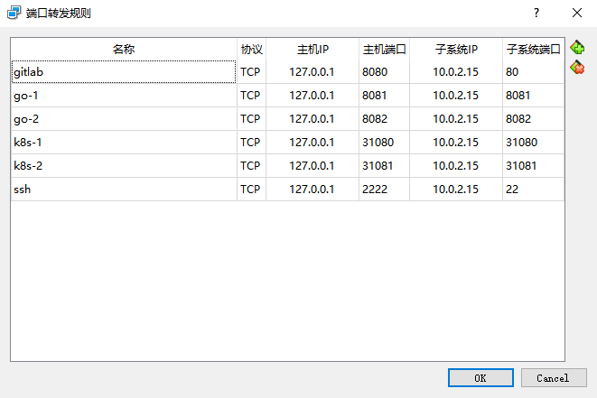

### Task 0: Install a ubuntu 16.04 server 64-bit

Install the virtualbox and ubuntu 16.04.6 VM.  

Select the "OpenSSH server" package and create the user "test" during the installation.

The IP addr of VM is 10.0.2.15

Use NAT network and  set the port forward in virtualbox:




### Task 1: Update system

From the  host machine ssh to guest machine through secureCRT using user test and port 2222.

To improve the update speed, use the aliyun sources instead of original sources.

```shell
sudo cp /etc/apt/sources.list /etc/apt/sources.list.old
sudo vim /etc/apt/sources.list

deb http://mirrors.aliyun.com/ubuntu/ xenial main restricted universe multiverse
deb http://mirrors.aliyun.com/ubuntu/ xenial-updates main restricted universe multiverse
deb http://mirrors.aliyun.com/ubuntu/ xenial-backports main restricted universe multiverse
deb http://mirrors.aliyun.com/ubuntu xenial-security main restricted universe multiverse
```
upgrade the kernel to the 16.04 latest:

```shell
sudo apt update
sudo apt upgrade
lsb_release -a
No LSB modules are available.
Distributor ID: Ubuntu
Description:    Ubuntu 16.04.7 LTS
Release:        16.04
Codename:       xenial
```


### Task 2: install gitlab-ce version in the host

```shell
sudo apt-get install -y curl openssh-server ca-certificates tzdata perl
sudo apt-get install -y postfix
```

select " internet site" and ensure the format of system mail name is correct.

```shell
curl -sS https://packages.gitlab.com/install/repositories/gitlab/gitlab-ce/script.deb.sh | sudo bash
sudo apt-get update
sudo EXTERNAL_URL="http://10.0.2.15" apt-get install gitlab-ce
```

Because the internet download speed is very slow, modify the sources to use Tsinghua sources:

```shell
sudo vim /etc/apt/sources.list.d/gitlab_gitlab-ce.list

#deb https://packages.gitlab.com/gitlab/gitlab-ce/ubuntu/ xenial main
#deb-src https://packages.gitlab.com/gitlab/gitlab-ce/ubuntu/ xenial main
deb https://mirrors.tuna.tsinghua.edu.cn/gitlab-ce/ubuntu/ xenial main
deb-src https://mirrors.tuna.tsinghua.edu.cn/gitlab-ce/ubuntu/ xenial main

sudo apt-get update
sudo EXTERNAL_URL="http://10.0.2.15" apt-get install gitlab-ce
```

10.0.2.15 is the IP address of VM, verify the installation:

```shell
curl http://10.0.2.15      
<html><body>You are being <a href="http://10.0.2.15/users/sign_in">redirected</a>.</body></html>
```

Access it in the host machine:

http://127.0.0.1:8080/

reset the password of root.

### Task 3: create a demo group/project in gitlab

- create the group "demo"
- create the project "go-web-hello-world" under the demo group

```shell
sudo apt-get install golang
mkdir -p ~/go/{bin,pkg,src}
vim ~/.profile 
```

add below lines:

```
export GOROOT=/usr/lib/go
export GOPATH=/home/test/go
export PATH=$PATH:$GOPATH/bin
```

create the hello.go under ~/go/src/hello directory.

```go
package main
import (
"fmt"
"net/http"
)

func main() {  
   http.HandleFunc("/", func(w http.ResponseWriter, r *http.Request) {  
      fmt.Fprintf(w, "Go Web Hello World!")    
   })  
   http.ListenAndServe(":8081", nil)  
}
```


check-in the code to mainline:

```shell
mkdir ~/git
cd ~/git
git clone http://10.0.2.15/demo/go-web-hello-world.git
cd go-web-hello-world/
cp ~/go/src/hello/hello.go .
git add hello.go
git commit -m "hello sample"
git push
input the username & password to push it.
```

Expect source code at http://127.0.0.1:8080/demo/go-web-hello-world

### Task 4: build the app and expose ($ go run) the service to 8081 port

install the app and run hello: 
```shell
go install
/home/test/go/bin/hello
```

open a new ssh session, expect output:

```shell
curl http://127.0.0.1:8081
Go Web Hello World!
```


### Task 5: install docker

```shell
sudo apt-get update
sudo apt-get install \
    apt-transport-https \
    ca-certificates \
    curl \
    gnupg
    
curl -fsSL https://download.docker.com/linux/ubuntu/gpg | sudo gpg --dearmor -o /usr/share/keyrings/docker-archive-keyring.gpg

echo \
  "deb [arch=amd64 signed-by=/usr/share/keyrings/docker-archive-keyring.gpg] https://download.docker.com/linux/ubuntu \
  $(lsb_release -cs) stable" | sudo tee /etc/apt/sources.list.d/docker.list > /dev/null
  
sudo apt-get update
sudo apt-get install docker-ce docker-ce-cli containerd.io
```


### Task 6: run the app in container

build a docker image ($ docker build) for the web app and run that in a container ($ docker run), expose the service to 8082 (-p)

Dockerfile:

```
FROM golang:latest
WORKDIR /go
COPY hello.go .
RUN go build hello.go
EXPOSE 8081
ENTRYPOINT ["./hello"]
```

build and run the image:

```shell
sudo docker build -t go-web-hello-world:v0.1 . 
sudo docker run -d -p 8082:8081 go-web-hello-world:v0.1
```

Expect output:
```shell
curl http://127.0.0.1:8082
Go Web Hello World!
```


### Task 7: push image to dockerhub

tag the docker image and push it to docker hub (https://hub.docker.com/)

```shell
sudo docker tag go-web-hello-world:v0.1 chensphere/go-web-hello-world:v0.1
sudo docker login
sudo docker push chensphere/go-web-hello-world:v0.1
```

Expect output: https://hub.docker.com/repository/docker/chensphere/go-web-hello-world

### Task 8: document the procedure in a MarkDown file

create a README.md file in the gitlab repo and add the technical procedure above (0-7) in this file

-----------------------------------

### Task 9: install a single node Kubernetes cluster using kubeadm
- disable swap:

```shell
sudo swapoff -a
```

- Letting iptables see bridged traffic:

```shell
cat <<EOF | sudo tee /etc/modules-load.d/k8s.conf
br_netfilter
EOF

cat <<EOF | sudo tee /etc/sysctl.d/k8s.conf
net.bridge.bridge-nf-call-ip6tables = 1
net.bridge.bridge-nf-call-iptables = 1
EOF
sudo sysctl --system
```

- Installing kubeadm, kubelet and kubectl, because of China network limitation, use aliyun sources to install:

```shell
sudo apt-get update && sudo apt-get install -y apt-transport-https
curl https://mirrors.aliyun.com/kubernetes/apt/doc/apt-key.gpg | sudo apt-key add - 
cat <<EOF | sudo tee /etc/apt/sources.list.d/kubernetes.list
deb https://mirrors.aliyun.com/kubernetes/apt/ kubernetes-xenial main
EOF
sudo apt-get update
sudo apt-get install -y kubelet kubeadm kubectl
sudo apt-mark hold kubelet kubeadm kubectl
```

- using kubeadm init the cluster,  to avoid the network access issue, use the parameter --image-repository to point to aliyun respository

```shell
sudo kubeadm init --image-repository registry.aliyuncs.com/google_containers --kubernetes-version v1.20.4 --pod-network-cidr=10.240.0.0/16 --service-cidr=10.96.0.0/12
```

-  run the following to start using the cluster:

```shell
  mkdir -p $HOME/.kube
  sudo cp -i /etc/kubernetes/admin.conf $HOME/.kube/config
  sudo chown $(id -u):$(id -g) $HOME/.kube/config
```

- install flannel:

```shell
kubectl apply -f https://raw.githubusercontent.com/flannel-io/flannel/master/Documentation/kube-flannel.yml
```

- check the components status:

```shell
kubectl get cs
Warning: v1 ComponentStatus is deprecated in v1.19+
NAME                 STATUS      MESSAGE                                                                                       ERROR
scheduler            Unhealthy   Get "http://127.0.0.1:10251/healthz": dial tcp 127.0.0.1:10251: connect: connection refused   
controller-manager   Unhealthy   Get "http://127.0.0.1:10252/healthz": dial tcp 127.0.0.1:10252: connect: connection refused   
etcd-0               Healthy     {"health":"true"}   
```

scheduler and controller-manager are **unhealthy**,  to solve the issue, it needs to comments "port=0" in the file kube-scheduler.yam and kube-controller-manager.yaml:

```shell
sudo vim /etc/kubernetes/manifests/kube-scheduler.yaml
sudo vim vim /etc/kubernetes/manifests/kube-controller-manager.yaml
#   - --port=0
sudo service kubelet restart
```

- Remove the taint of Master:

```shell
kubectl taint nodes --all node-role.kubernetes.io/master-
```

- Check in the admin.conf file into the gitlab repo

### Task 10: deploy the hello world container

in the kubernetes above and expose the service to nodePort 31080

create the hello-nodeport.yaml file:

```shell
apiVersion: v1
kind: Service
metadata:
  name: gowebapp
  namespace: default
spec:
  selector:
    app: gowebapp
  type: NodePort
  ports: 
  - port: 8081
    targetPort: 8081
    nodePort: 31080

---

kind: Deployment
apiVersion: apps/v1
metadata:
  labels:
    app: gowebapp
  name: gowebapp-deploy
  namespace: default
spec:
  replicas: 1
  selector:
    matchLabels:
      app: gowebapp
  template:
    metadata:
      labels:
        app: gowebapp
    spec:
      containers:
        - name: goweb
          image: chensphere/go-web-hello-world:v0.1
          ports:
            - containerPort: 8081
              protocol: TCP
```

apply the yaml file to create the service and deployment:
```
kubectl apply -f hello-nodeport.yaml
```

Expect output:
```
curl http://127.0.0.1:31080
Go Web Hello World!
```

Check in the deployment yaml file into the gitlab repo

------------------------------------

### Task 11: install kubernetes dashboard

```
kubectl apply -f https://raw.githubusercontent.com/kubernetes/dashboard/v2.0.0/aio/deploy/recommended.yaml
```

expose the service to nodeport 31081

```
kubectl patch svc kubernetes-dashboard -n kubernetes-dashboard \
-p '{"spec":{"type":"NodePort","ports":[{"port":443,"targetPort":8443,"nodePort":31081}]}}'
```

Expect output: https://127.0.0.1:31081 (asking for token)

### Task 12: generate token for dashboard login in task 11

- create a ServiceAccount admin-user
- ClusterRoleBinding the ServiceAccount to ClusterRole cluster-admin

```
cat > dashboard-adminuser.yaml << EOF
apiVersion: v1
kind: ServiceAccount
metadata:
  name: admin-user
  namespace: kubernetes-dashboard

---
apiVersion: rbac.authorization.k8s.io/v1
kind: ClusterRoleBinding
metadata:
  name: admin-user
roleRef:
  apiGroup: rbac.authorization.k8s.io
  kind: ClusterRole
  name: cluster-admin
subjects:
- kind: ServiceAccount
  name: admin-user
  namespace: kubernetes-dashboard
EOF

kubectl apply -f dashboard-adminuser.yaml

```

- get the token info


```
kubectl -n kubernetes-dashboard describe secret $(kubectl -n kubernetes-dashboard get secret | grep admin-user | awk '{print $1}') |sed -n '/token:.*/p'

token:      eyJhbGciOiJSUzI1NiIsImtpZCI6InBidXhvYzAzaDlwT3ZKLW8wTW9OT1hvWFc0STZxM3Ayc1k0YlVqaWl1WXMifQ.eyJpc3MiOiJrdWJlcm5ldGVzL3NlcnZpY2VhY2NvdW50Iiwia3ViZXJuZXRlcy5pby9zZXJ2aWNlYWNjb3VudC9uYW1lc3BhY2UiOiJrdWJlcm5ldGVzLWRhc2hib2FyZCIsImt1YmVybmV0ZXMuaW8vc2VydmljZWFjY291bnQvc2VjcmV0Lm5hbWUiOiJhZG1pbi11c2VyLXRva2VuLW1xZmt0Iiwia3ViZXJuZXRlcy5pby9zZXJ2aWNlYWNjb3VudC9zZXJ2aWNlLWFjY291bnQubmFtZSI6ImFkbWluLXVzZXIiLCJrdWJlcm5ldGVzLmlvL3NlcnZpY2VhY2NvdW50L3NlcnZpY2UtYWNjb3VudC51aWQiOiI4YTZmNDI4NS1lMmFjLTQ4NTUtYjM5MC0yN2I5YzEwZDQwZjIiLCJzdWIiOiJzeXN0ZW06c2VydmljZWFjY291bnQ6a3ViZXJuZXRlcy1kYXNoYm9hcmQ6YWRtaW4tdXNlciJ9.XO9ug1AyEE2-JZc7O4wIfi_cN2ptX0mBSOTL12s5pwP27YgsUUvQjsXy1FltH3LjBdJHLK6UR_rVYgvwesGDyMFuwK_VwiVkxeV01eOtPeS6S4on6GS8XyL01r4PUlG3CHdsfmxUOXBX0UHUIysrDkEJTJMXhOLuqmYZojJN9vtlTyRhBQfzQtOnio_1RMiLhZZoJiaLGzwq7AvS_AeWq7XIYVvvS0SiCWXxAMazKG587-w6j4a-SM6naixTELR89d8DornHqPFocsvVdolbwA31wl-AKRIlWAupiIctYcuS926Tk9orBbXYA01UP-xuDNJPtLStYu_XXiYSIL45eA
```


--------------------------------------

### Task 13: publish your work

push all files to local gitlab repo:

```
git add .
git commit -m "add new files"
git push
```

push all files to  remote github repo (https://github.com/chensg99/go-web-hello-world)

```
git config --global --edit
git remote remove origin
git remote add origin https://github.com/chensg99/go-web-hello-world.git
git push -u origin master
```


